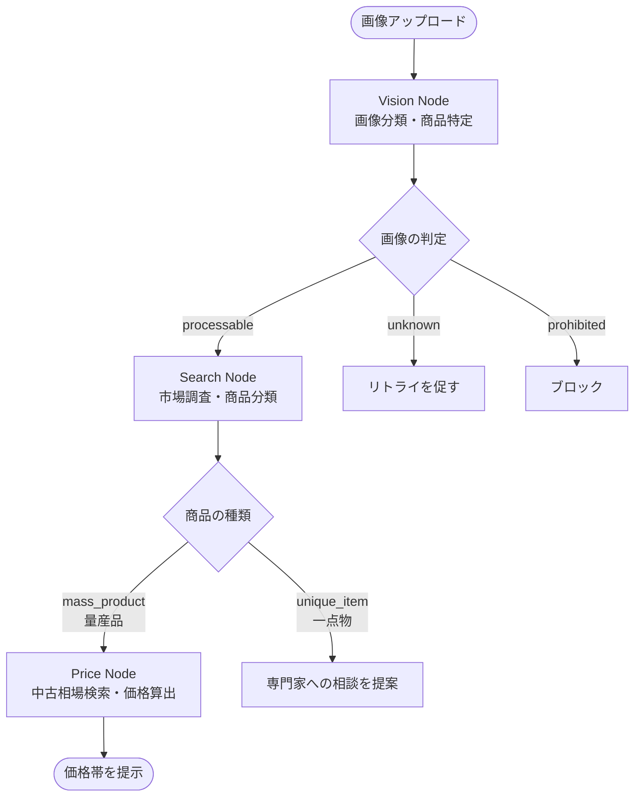

# Ojoya

> 写真1枚で中古相場がわかる — AI商品査定アプリ

フリマで不用品を売りたいけど、相場の調べ方がわからない。調べるのがめんどくさい。
Ojoya（オホヤ）は、**写真を撮るだけで商品を特定し、中古市場の価格帯を提示するAIエージェントアプリ**です。

## 使い方

1. スマホで商品を撮影してアップロード
2. AIが画像を解析し、市場を調査（リアルタイムで進捗が見える）
3. 価格帯と信頼度が表示される

## AIパイプライン

LangGraphで構築した3段階のAIエージェントが、画像認識・市場調査・価格算出をパイプラインで処理します。すべての画像を最後まで処理するのではなく、**条件分岐で早期終了**させることでコストとユーザー体験を最適化しています。

| ノード | 役割 |
|--------|------|
| **Vision Node** | 画像の門番。ガードレイルチェック（顔写真・動物・現金等をブロック）後、Google Lens検索で商品を特定 |
| **Search Node** | Google Search Grounding で市場調査。量産品か一点物かを判定し、一点物は専門家相談へルーティング |
| **Price Node** | 量産品のみ到達。メルカリ・ヤフオク等の相場を調べ、価格帯（min/max）と信頼度を算出 |

## 実装のこだわり

- **アップサイドポテンシャルの提示** — 完全な査定ができない場合でも「もし初版であれば15万円の可能性があります」のように、ユーザーが自分で確認するきっかけとなるヒントを返す
- **リアルタイム進捗のストリーミング配信** — 各ノードの開始・途中経過・完了をSSEで配信し、ユーザーの待ち時間の体験を改善
- **条件分岐による早期終了でLLMコストを最適化** — 禁止物は1ノード、一点物は2ノードで処理を打ち切り、不要なLLM呼び出しを省略

## 技術スタック

| レイヤー | 技術 |
|---------|------|
| Frontend | React 19 + TypeScript + Vite |
| Backend | FastAPI + Python 3.12 |
| AI Orchestration | LangGraph |
| LLM | Gemini 2.5 Flash (Vertex AI) |
| Image Search | SerpAPI  |
| Database | Cloud Firestore |
| Storage | Cloud Storage |
| Compute | Cloud Run |

## 詳細記事

設計思想や技術的な詳細については、以下の記事をご覧ください。

- [写真1枚でフリマ出品価格がわかる — LangGraph × Geminiで作ったAI査定アプリ「Ojoya」](articles/ojoya-agentic-hackathon.md)

## ライセンス

本プロジェクトは以下のOSSライブラリを使用しています:

### バックエンド
- [FastAPI](https://github.com/fastapi/fastapi) - MIT License
- [LangChain](https://github.com/langchain-ai/langchain) / [LangGraph](https://github.com/langchain-ai/langgraph) - MIT License
- [Firebase Admin SDK](https://github.com/firebase/firebase-admin-python) - Apache License 2.0
- [Google Cloud Client Libraries](https://github.com/googleapis/python-storage) - Apache License 2.0

### フロントエンド
- [React](https://github.com/facebook/react) - MIT License
- [Vite](https://github.com/vitejs/vite) - MIT License
- [Firebase JavaScript SDK](https://github.com/firebase/firebase-js-sdk) - Apache License 2.0
- [React Router](https://github.com/remix-run/react-router) - MIT License
